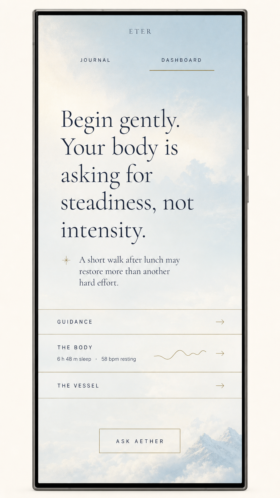
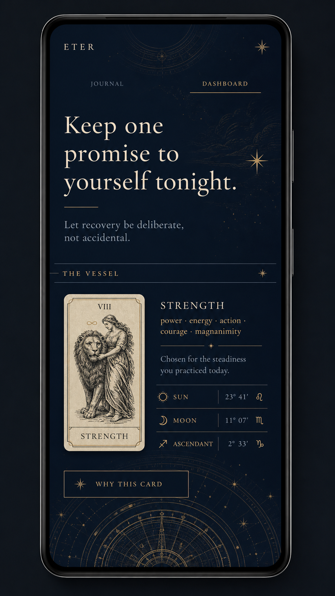
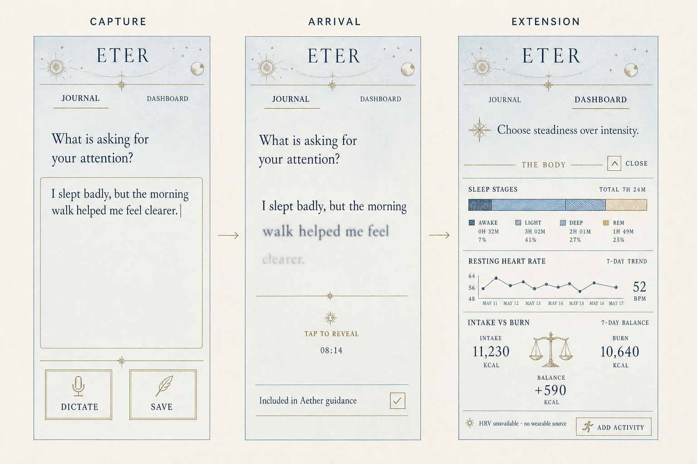

# Eter UI direction

This document is the visual bridge between the product authority in
[`STEERING_BRIEF.md`](STEERING_BRIEF.md) and the implementation contract in
[`UI_BRIEF.md`](UI_BRIEF.md). It gives the UI implementer a compositional north
star. It does not override either brief.

The concept images are **mood and hierarchy studies, not screenshots to trace**.
Generated typography, icons, chart values and spacing are illustrative. The
Flutter tokens, accessibility requirements, real data contracts and existing
art remain authoritative.

## Product-owner refinement — 27 July 2026

The concept plates established the correct atmosphere, but they contain too
much visible interface. The implementation must be **quieter than the plates**.

- Preserve the custom pale-sky character of the day concept. Treat it as the
  preferred direction for the day background rather than recreating the
  concept's mountains literally.
- Keep the small astrological engraving around the `ETER` name. This is the
  shell's principal decorative signature and should be shared by Journal and
  Dashboard.
- Remove borders and boxes from ordinary actions. Actions should usually be
  compact words or familiar glyphs resting directly on the background.
- A control may look small while retaining an invisible minimum 48×48 dp hit
  region. “Smaller” never means harder to tap or read.
- Make the Journal feel like an actual personal journal, not a form, chat
  composer or bordered text area.
- Show less at once. The resting state should feel intentionally incomplete:
  one voice, one subtle way deeper, and no preview dashboard competing below.

## The visual thesis

Eter is an **editorial sky with a private journal and instruments beneath it**.

The first viewport is closer to the opening page of a beautifully typeset book
than to a wellness dashboard. It offers one thought, one direction and enough
space for the user to hear both. Detail is not removed; it is folded beneath
engraved rules and opened in place.

The system has one skeleton and two atmospheric registers:

- **Day:** the concept plate's pale, softly variegated cloud sky; dark ink;
  generous ivory lift behind text only when contrast needs it; stillness;
  extremely restrained ornament.
- **Night:** the identical hierarchy in midnight navy and warm ivory, with
  antique-gold engraving and slow ambient depth. Ornament grows; density does
  not.

Do not make day the plain product and night the premium-looking product. Both
must feel complete.

## Concept plates

### Day guidance

What to keep: guidance owns the viewport; navigation is visible but quiet;
the sky continues behind the whole composition; the pale atmospheric day
background is the preferred replacement direction for the current one.

What not to copy literally: the rendered phone proportions, oversized display
type, mountain placement, bordered action and three simultaneous section rows.
The real resting screen must contain less. Fit real devices from 320–600 dp and
dynamic type to 200%.

### Night Vessel

What to keep: night is luminous ink rather than neon glow; the Arcana card is
the one physical object allowed to feel card-like; symbolic material remains
subordinate to guidance; astrological geometry belongs near the edge and below
content, never between text and reader. The fine solar/lunar engraving around
the Eter name is approved and should become a restrained shared-header motif.

What not to copy literally: the generated card illustration. Use the shipped
Arcana assets and `AnimatedArcanaCard`. Do not add ornamental glyphs merely to
fill space.

### Capture → arrival → extension

What to keep: capture is immediate; the same text-arrival grammar serves
Journal and guidance; an expanded instrument grows directly beneath the
guidance; missing data is stated in words; closing restores the prior
composition and scroll state.

What not to copy literally: the bordered writing box, large boxed Dictate/Save
controls, iconography and exact charts. Use the existing control vocabulary and
build charts in the `EngravedBalance` idiom.

## Composition grammar

Every primary surface should be assembled in this order:

1. **Place** — `SkyBackground` establishes one continuous environment.
2. **Signature** — Eter mark with one shared solar/lunar or astrolabe
   engraving. Keep it fine, shallow and identical across primary surfaces.
3. **Orientation** — Journal/Dashboard labels and travelling hairline.
4. **Voice** — the dominant guidance or journal writing field.
5. **Threshold** — one quiet text affordance announcing deeper content.
6. **Instrument** — health detail or symbolic object expanded in place.
7. **Return** — an explicit compact close affordance that restores the voice.

This order is also the semantic and focus order. Background ornament is always
excluded from semantics.

### Density budget

- In the initial Dashboard viewport, allow one primary passage and optionally
  one supporting passage. Do not show metrics, charts, section previews or
  multiple boxed thresholds in the resting state.
- Offer deeper content through one quiet disclosure line at a time. The
  currently relevant doorway may read `Body`, `Vessel` or `More`; the other
  destinations remain discoverable through the same compact disclosure area,
  not three competing rows.
- Only one Dashboard section may be expanded at a time.
- An expanded section begins with its conclusion, then evidence, then controls.
  Never lead with a chart.
- Do not place health and symbolic instruments side by side on phone widths.
- A line, change in spacing or typography should solve containment before
  `EterPlate` is introduced.
- Ornament, navigation, evidence and controls must never all be visually
  assertive at once. If the page feels “designed”, remove something.

### Vertical rhythm

Use the token scale, with `s24` as the ordinary editorial beat and `s48`/`s64`
around the main voice. Hairlines may touch the viewport edges; readable content
keeps `gutter`. Avoid evenly spaced component stacks—the main passage needs
more air than instruments.

### Typography roles

- Cormorant Garamond: guidance, journal prompts, composed readings and sparse
  editorial headings.
- Inter: controls, navigation, evidence, timestamps, labels and every number.
- Set numerals tabular. Keep prose line length near 24–34 characters on a
  typical phone.
- Display scale must respond to both width and text scale. The concept plates'
  large type is a mood cue, not a fixed size.
- Letterspaced capitals are for orientation, not paragraphs or warnings.

## The Journal as an object

The Journal is not a health input form with a literary font. It should feel like
opening the same private book each day.

- Retain the atmospheric sky around the page, but give the writing region a
  warmer, quieter parchment field with subtle paper grain and a natural page
  edge or inner margin. No complete rectangular border.
- Use a date-led page: weekday and date act as the entry's heading. Time is a
  quiet marginal annotation, not metadata in a card header.
- The writing field is visually open. No rounded container, outline, fill or
  “message composer” bar. A faint baseline or ruled rhythm is permitted only if
  it remains readable at all text scales and does not resemble a form.
- Existing entries read as continuous dated prose separated by space, a small
  folio mark or a short hairline—not individual cards.
- Place the insertion point where a pen would begin on a page. Tapping the open
  page starts writing immediately.
- Dictation is a small conventional microphone glyph with the visible label
  available to semantics. Save may be a compact `Done` word; autosave should
  reduce the need to present Save persistently.
- Date browsing should evoke page movement through typography and transition,
  but must also have explicit previous/next and calendar targets.
- Privacy inclusion is a marginal note beneath the entry, not a prominent
  toggle row interrupting the writing.
- Night Journal remains `SurfaceIntent.plain`: warm ivory-on-navy or a dark
  paper field, without constellations beneath prose.

## The signature arrival

The reveal should feel like focus arriving across a sentence:

1. Sentence begins slightly displaced (no more than 4 dp), softly blurred and
   low-contrast.
2. Words resolve in short overlapping groups; never reveal character by
   character and never show a cursor.
3. Contrast, blur and displacement settle together on `easeAir`.
4. Pause between sentences, not between every word. The full sentence consumes
   no more than `durSentence`.
5. Any tap in the reveal region resolves the whole passage immediately.
6. With reduced motion, render the final state on the first frame.

Build one reusable widget and test it with both guidance and Journal arrival.
Avoid shader complexity until a simple opacity/blur/translation prototype has
been profiled on a mid-range Android device.

## Interaction states the implementation must design

Each surface needs deliberate states, not just its ideal screenshot:

| Surface | Required states |
|---|---|
| Guidance | arriving, settled, immediately revealed, expanded, stale/cached, offline fallback |
| Journal | empty, composing, dictating, transcription correction, saving, arrived, excluded from Aether |
| Body | partial data, no wearable, stale source, loading local data, unconfirmed meal, corrected meal |
| Vessel | keywords only, composing, composed, daily card revealed, reduced motion |
| Shell | Journal active, Dashboard active, Sanctum overlay, keyboard open, restored state |

Loading should preserve known content. An uncomposed reading is content, not a
spinner. Unknown health data is an explicit absence, not zero.

## Control and icon direction

- Prefer words over novel glyphs for essential actions.
- Use icons only when the symbol is conventional or paired with a label.
- Ordinary actions have **no visible border, surrounding box or fill**. Use
  weight, tone and placement for hierarchy.
- Primary action: a compact text label, optionally accompanied by a short
  underline that belongs to the typography rather than enclosing the control.
- Quiet action: a small word or familiar glyph with a minimum 48×48 dp
  invisible hit region.
- A surrounding rule is reserved for section structure, not used as the four
  sides of a button.
- Toggles are square and mechanical, like a small instrument switch.
- Evidence receipts use a superscript-sized gold reference mark; tapping opens
  a readable square-cornered annotation or the one permitted rounded sheet.
- Do not invent new celestial decoration at feature level. Reuse
  `StarOrnament`, `OrnamentDivider`, commissioned element art and chart
  instrument language.

## Motion hierarchy

Only one motion may ask for attention at a time.

1. Text arrival is primary.
2. In-place expansion is secondary.
3. Night atmosphere is ambient and stops being perceptible when the user reads.
4. Arcana motion occurs only during a deliberate reveal.

Day has no ambient motion. Scrolling must not trigger decorative parallax.
Expansion uses `AnimatedSize` and should preserve the passage's visual anchor.

## Prototype approval gate

Before building the complete Journal or any chart suite, produce one runnable
prototype containing:

- day and night Dashboard guidance;
- the shared arrival widget, tap-to-complete and reduced-motion behavior;
- the refined day background and shared astrological Eter header;
- the persistent Journal/Dashboard affordance;
- an actual-journal capture surface with borderless keyboard/dictation actions;
- one compact, borderless Body disclosure opening one fixture-backed instrument
  in place;
- explicit close and state restoration;
- 320 dp, 390 dp and 600 dp width captures at text scales 1.0 and 2.0.

Approve the prototype on four questions:

1. Does the first glance land on guidance rather than navigation or metrics?
2. Can a new user discover Journal and Body without being taught a gesture?
3. Does night feel deeper without becoming busier?
4. Can every animation disappear without losing meaning?
5. Does the Journal feel like a place to write rather than a data-entry form?
6. Can any visible border or control be removed without harming discovery?

If any answer is no, fix the defining interaction before expanding scope.

## Handoff instruction for Kimi K3

Read in this order:

1. `STEERING_BRIEF.md`
2. `UI_BRIEF.md`
3. this document and its three concept plates
4. `core/register.dart`, `core/tokens.dart`, `core/theme.dart`,
   `core/controls.dart`, `core/widgets.dart` and `core/instruments.dart`

Implement the prototype approval gate only. Use fixture data against the real
database contracts. Do not redesign the tokens, add a component library, add a
chart package, or broaden the first pass into all application surfaces. Treat
the product-owner refinement at the top of this document as the final visual
word when a concept plate shows more interface than these instructions allow.
